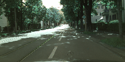
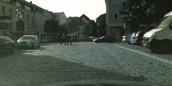
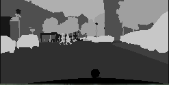

# Semantic-Segmentation-Pytorch

[](https://pypi.org/project/seg-torch)

Pytorch implementation of FCN, UNet, PSPNet and various encoder models.

## Models

This project supports models as follow:

| model name          | encoder model       | decoder model       |
|:-------------------:|:-------------------:|:-------------------:|
| fcn8_vgg11          | VGG 11              | FCN8                |
| fcn8_vgg13          | VGG 13              | FCN8                |
| fcn8_vgg16          | VGG 16              | FCN8                |
| fcn8_vgg19          | VGG 19              | FCN8                |
| fcn16_vgg11         | VGG 11              | FCN16               |
| fcn16_vgg13         | VGG 13              | FCN16               |
| fcn16_vgg16         | VGG 16              | FCN16               |
| fcn16_vgg19         | VGG 19              | FCN16               |
| fcn32_vgg11         | VGG 11              | FCN32               |
| fcn32_vgg13         | VGG 13              | FCN32               |
| fcn32_vgg16         | VGG 16              | FCN32               |
| fcn32_vgg19         | VGG 19              | FCN32               |
| fcn8_resnet18       | Resnet-18           | FCN8                |
| fcn8_resnet34       | Resnet-34           | FCN8                |
| fcn8_resnet50       | Resnet-50           | FCN8                |
| fcn8_resnet101      | Resnet-101          | FCN8                |
| fcn8_resnet152      | Resnet-152          | FCN8                |
| fcn16_resnet18      | Resnet-18           | FCN16               |
| fcn16_resnet34      | Resnet-34           | FCN16               |
| fcn16_resnet50      | Resnet-50           | FCN16               |
| fcn16_resnet101     | Resnet-101          | FCN16               |
| fcn16_resnet152     | Resnet-152          | FCN16               |
| fcn32_resnet18      | Resnet-18           | FCN32               |
| fcn32_resnet34      | Resnet-34           | FCN32               |
| fcn32_resnet50      | Resnet-50           | FCN32               |
| fcn32_resnet101     | Resnet-101          | FCN32               |
| fcn32_resnet152     | Resnet-152          | FCN32               |
| fcn8_mobilenet_v2   | MobileNet-v2        | FCN8                |
| fcn16_mobilenet_v2  | MobileNet-v2        | FCN16               |
| fcn32_mobilenet_v2  | MobileNet-v2        | FCN32               |
| unet                | None                | Unet                |
| unet_vgg11          | VGG11               | Unet                |
| unet_vgg13          | VGG13               | Unet                |
| unet_vgg16          | VGG16               | Unet                |
| unet_vgg19          | VGG19               | Unet                |
| unet_resnet18       | Resnet-18           | Unet                |
| unet_resnet34       | Resnet-34           | Unet                |
| unet_resnet50       | Resnet-50           | Unet                |
| unet_resnet101      | Resnet-101          | Unet                |
| unet_resnet152      | Resnet-152          | Unet                |
| unet_mobilenet_v2   | MobileNet-v2        | Unet                |
| pspnet_vgg11        | VGG11               | PSPNet              |
| pspnet_vgg13        | VGG13               | PSPNet              |
| pspnet_vgg16        | VGG16               | PSPNet              |
| pspnet_vgg19        | VGG19               | PSPNet              |
| pspnet_resnet18     | Resnet-18           | PSPNet              |
| pspnet_resnet34     | Resnet-34           | PSPNet              |
| pspnet_resnet50     | Resnet-50           | PSPNet              |
| pspnet_resnet101    | Resnet-101          | PSPNet              |
| pspnet_resnet152    | Resnet-152          | PSPNet              |
| pspnet_mobilenet_v2 | MobileNet-v2        | PSPNet              |

Example results of the pspnet_mobilenet_v2 model:

Input Image            |  Ground Truth image    | Result Image      |
:-------------------------:|:-------------------------:|:-------------------------:|
  |    |  
  |    |  

## Requirements

- [pytorch](https://github.com/pytorch/pytorch) >= 1.5.0
- [torchvision](https://github.com/pytorch/vision) >= 0.6.0
- opencv-python
- [tqdm](https://github.com/tqdm/tqdm)

## Install

```shell
pip install seg-torch
```

or

```shell
git clone https://github.com/IanTaehoonYoo/semantic-segmentation-pytorch/
cd semantic-segmentation-pytorch
python setup.py install
```

