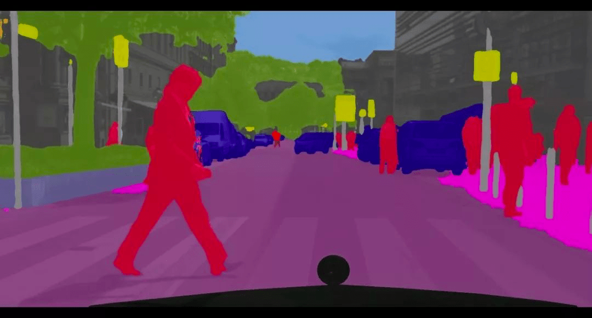
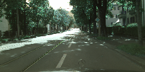
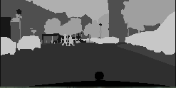
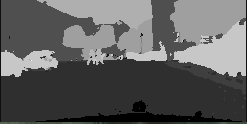

# Semantic-Segmentation-Pytorch

[](https://pypi.org/project/seg-torch)

Pytorch implementation of FCN, UNet, PSPNet and various encoder models for the semantic segmentation.
<p align="center">
      
      <br></br>
</p>

These are the reference implementation of the models.
- FCN (Fully Convolutional Networks for Sementic Segmentation) [[Paper]](https://arxiv.org/abs/1411.4038)
- UNet (Convolutional Networks for Biomedical Image Segmentation) [[Paper]](https://arxiv.org/abs/1505.04597)
- PSPNet (Pyramid Scene Parsing Network) [[Paper]](https://arxiv.org/abs/1612.01105)

## Models

This project supports models as follow:

| model name          | backbone model       | decoder model       |
|:-------------------:|:-------------------:|:-------------------:|
| fcn8_vgg11          | VGG 11              | FCN8                |
| fcn8_vgg13          | VGG 13              | FCN8                |
| fcn8_vgg16          | VGG 16              | FCN8                |
| fcn8_vgg19          | VGG 19              | FCN8                |
| fcn16_vgg11         | VGG 11              | FCN16               |
| fcn16_vgg13         | VGG 13              | FCN16               |
| fcn16_vgg16         | VGG 16              | FCN16               |
| fcn16_vgg19         | VGG 19              | FCN16               |
| fcn32_vgg11         | VGG 11              | FCN32               |
| fcn32_vgg13         | VGG 13              | FCN32               |
| fcn32_vgg16         | VGG 16              | FCN32               |
| fcn32_vgg19         | VGG 19              | FCN32               |
| fcn8_resnet18       | Resnet-18           | FCN8                |
| fcn8_resnet34       | Resnet-34           | FCN8                |
| fcn8_resnet50       | Resnet-50           | FCN8                |
| fcn8_resnet101      | Resnet-101          | FCN8                |
| fcn8_resnet152      | Resnet-152          | FCN8                |
| fcn16_resnet18      | Resnet-18           | FCN16               |
| fcn16_resnet34      | Resnet-34           | FCN16               |
| fcn16_resnet50      | Resnet-50           | FCN16               |
| fcn16_resnet101     | Resnet-101          | FCN16               |
| fcn16_resnet152     | Resnet-152          | FCN16               |
| fcn32_resnet18      | Resnet-18           | FCN32               |
| fcn32_resnet34      | Resnet-34           | FCN32               |
| fcn32_resnet50      | Resnet-50           | FCN32               |
| fcn32_resnet101     | Resnet-101          | FCN32               |
| fcn32_resnet152     | Resnet-152          | FCN32               |
| fcn8_mobilenet_v2   | MobileNet-v2        | FCN8                |
| fcn16_mobilenet_v2  | MobileNet-v2        | FCN16               |
| fcn32_mobilenet_v2  | MobileNet-v2        | FCN32               |
| unet                | Unet                | Unet                |
| unet_vgg11          | VGG11               | Unet                |
| unet_vgg13          | VGG13               | Unet                |
| unet_vgg16          | VGG16               | Unet                |
| unet_vgg19          | VGG19               | Unet                |
| unet_resnet18       | Resnet-18           | Unet                |
| unet_resnet34       | Resnet-34           | Unet                |
| unet_resnet50       | Resnet-50           | Unet                |
| unet_resnet101      | Resnet-101          | Unet                |
| unet_resnet152      | Resnet-152          | Unet                |
| unet_mobilenet_v2   | MobileNet-v2        | Unet                |
| pspnet_vgg11        | VGG11               | PSPNet              |
| pspnet_vgg13        | VGG13               | PSPNet              |
| pspnet_vgg16        | VGG16               | PSPNet              |
| pspnet_vgg19        | VGG19               | PSPNet              |
| pspnet_resnet18     | Resnet-18           | PSPNet              |
| pspnet_resnet34     | Resnet-34           | PSPNet              |
| pspnet_resnet50     | Resnet-50           | PSPNet              |
| pspnet_resnet101    | Resnet-101          | PSPNet              |
| pspnet_resnet152    | Resnet-152          | PSPNet              |
| pspnet_mobilenet_v2 | MobileNet-v2        | PSPNet              |

Example results of the pspnet_mobilenet_v2 model:

Input Image            |  Ground Truth Image    | Result Image      |
:-------------------------:|:-------------------------:|:-------------------------:|
  |    |  
  |    |  

## Getting Started

### Requirements

- [pytorch](https://github.com/pytorch/pytorch) >= 1.5.0
- [torchvision](https://github.com/pytorch/vision) >= 0.5.0
- [TensorboardX](https://github.com/lanpa/tensorboardX) >= 0.2.0
- opencv-python
- [tqdm](https://github.com/tqdm/tqdm)

### Installation

```shell
pip install seg-torch
```

or

```shell
git clone https://github.com/IanTaehoonYoo/semantic-segmentation-pytorch/
cd semantic-segmentation-pytorch
python setup.py install
```
### Preparing the data for training

In this project, the data for training is the [[Cityspaces]](https://www.cityscapes-dataset.com/). You can run this project using the sample dataset in the segmentation/test/dataset/cityspaces folder. If you want to run this project using another dataset, please refer to the dataset format as below.

1. There are two folders which are the training images folder and the groundtruth labeled images folder.
2. The training image and the labeled image must have the same file name and size.
3. The training image must be the RGB image, and the labeled image should have the class value, the range [0, n_classes].

### Example code to use this project with python

```python
from torchvision import transforms

from segmentation.data_loader.segmentation_dataset import SegmentationDataset
from segmentation.data_loader.transform import Rescale, ToTensor
from segmentation.trainer import Trainer
from segmentation.predict import *
from segmentation.models import all_models
from util.logger import Logger

train_images = r'dataset/cityspaces/images/train'
test_images = r'dataset/cityspaces/images/test'
train_labled = r'dataset/cityspaces/labeled/train'
test_labeled = r'dataset/cityspaces/labeled/test'

if __name__ == '__main__':
    model_name = "fcn8_vgg16"
    device = 'cuda'
    batch_size = 4
    n_classes = 34
    num_epochs = 10
    image_axis_minimum_size = 200
    pretrained = True
    fixed_feature = False

    logger = Logger(model_name=model_name, data_name='example')

    ### Loader
    compose = transforms.Compose([
        Rescale(image_axis_minimum_size),
        ToTensor()
         ])

    train_datasets = SegmentationDataset(train_images, train_labled, n_classes, compose)
    train_loader = torch.utils.data.DataLoader(train_datasets, batch_size=batch_size, shuffle=True, drop_last=True)

    test_datasets = SegmentationDataset(test_images, test_labeled, n_classes, compose)
    test_loader = torch.utils.data.DataLoader(test_datasets, batch_size=batch_size, shuffle=True, drop_last=True)

    ### Model
    model = all_models.model_from_name[model_name](n_classes, batch_size,
                                                   pretrained=pretrained,
                                                   fixed_feature=fixed_feature)
    model.to(device)

    ###Load model
    ###please check the foloder: (.segmentation/test/runs/models)
    #logger.load_model(model, 'epoch_15')

    ### Optimizers
    if pretrained and fixed_feature: #fine tunning
        params_to_update = model.parameters()
        print("Params to learn:")
        params_to_update = []
        for name, param in model.named_parameters():
            if param.requires_grad == True:
                params_to_update.append(param)
                print("\t", name)
        optimizer = torch.optim.Adadelta(params_to_update)
    else:
        optimizer = torch.optim.Adadelta(model.parameters())

    ### Train
    #scheduler = torch.optim.lr_scheduler.StepLR(optimizer, step_size=10, gamma=0.1)
    trainer = Trainer(model, optimizer, logger, num_epochs, train_loader, test_loader)
    trainer.train()


    #### Writing the predict result.
    predict(model, r'dataset/cityspaces/input.png',
             r'dataset/cityspaces/output.png')
```

### Pre-trained models (Encoder models)

This project uses pre-trained models such as VGG, ResNet, and MobileNet from the torchvision library. If you want the fine-tunning model, you can change the input parameters which are 'pretrained' and 'fixed_feature' when calling a model. And then, you should set the optimizer to freeze the model like as follow.

```python
    model = all_models.model_from_name[model_name](n_classes, batch_size,
                                                   pretrained=pretrained,
                                                   fixed_feature=fixed_feature)
                                                   
    # Optimizers
    if pretrained and fixed_feature: #fine-tunning
        params_to_update = model.parameters()
        print("Params to learn:")
        params_to_update = []
        for name, param in model.named_parameters():
            if param.requires_grad == True:
                params_to_update.append(param)
                print("\t", name)
        optimizer = torch.optim.Adadelta(params_to_update)
    else:
        optimizer = torch.optim.Adadelta(model.parameters())
        
```

### Getting the learning results on Tensorboard

The Logger class is to write the result such as mean IoU, accuracy, loss, and predict labeled images. The logger class gets the model name and the data name. So, it can generate the tensorboard files automatically in the runs folder, .\segmentation\runs\

Here is example command to see the result

```python
tensorboard --logdir=%project_path\segmentation\runs --host localhost
```

If you don't know about Tensorboard, please refer to [[Tensorboard]](https://www.tensorflow.org/tensorboard/get_started)

### Saving and loading the check points

The trainer class can save the check point automatically depends on argument is called 'check_point_epoch_stride'. So check points will be saved for every epoch stride in the runs folder, ./segmentation/runs/models.

Also, you can load the check point using the logger class. Here are example codes, please refer to as below.

```python

"""
Save check point.
Please check the runs folder, ./segmentation/runs/models
"""
check_point_stride = 30 # the checkpoint is saved for every 30 epochs.

#'model_name' and 'data_name' are to set a path to save the check point. 
# So you should set the same the Logger's arguemnts when you load the check point.
logger = Logger(model_name="pspnet_mobilenet_v2", data_name='example')

trainer = Trainer(model, optimizer, logger, num_epochs,
                      train_loader, test_loader,
                      check_point_epoch_stride=check_point_stride)

```

```python
"""
Load check point.
"""
n_classes = 33
batch_size = 4

# The Logger's arguemnts should be the same as when you train the model.
logger = Logger(model_name="pspnet_mobilenet_v2", data_name='example')

model = all_models.model_from_name[model_name](n_classes, batch_size)
logger.load_model(model, 'epoch_253')                      
```

## Cite This Project
If you find this code useful, please consider the following BibTeX entry.

```bash
@misc{seg-pytorch,
  author =       {Ian Yoo},
  title =        {{sementic-segmentation-pytorch: Pytorch implementation of FCN, UNet, PSPNet and various encoder models}},
  howpublished = {\url{https://github.com/IanTaehoonYoo/semantic-segmentation-pytorch}},
  year =         {2020}
}
```
